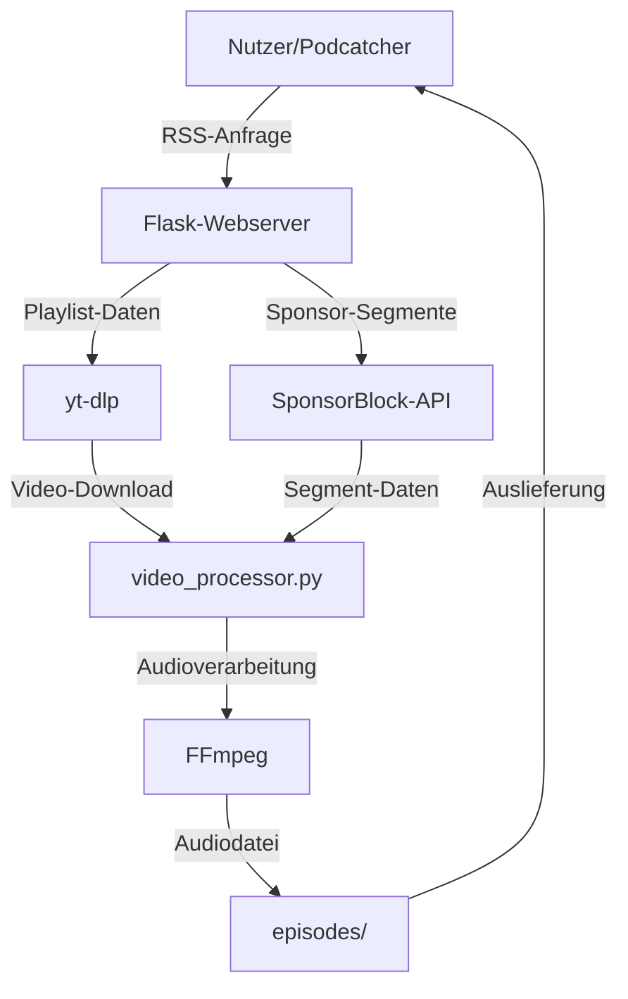

# SponsorBlock Podcast Generator – Projektdokumentation

## Projektübersicht

Der SponsorBlock Podcast Generator ist ein Python-basierter Webservice, der YouTube-Playlists oder -Kanäle in werbefreie Podcasts umwandelt. Mithilfe der SponsorBlock-API werden gesponserte Segmente automatisch entfernt. Das Ergebnis ist ein Podcast-kompatibler RSS-Feed mit optimierten Audiodateien (MP3/M4A), der direkt in Podcast-Playern wie Pocket Casts oder Apple Podcasts abonniert werden kann.

## Zielgruppe und Anwendungsfälle

Der SponsorBlock Podcast Generator richtet sich an:
- **Privatnutzer**, die YouTube-Inhalte wie Interviews, Vorträge oder Tutorials als werbefreie Podcasts konsumieren möchten.
- **Podcaster**, die Inhalte von YouTube-Kanälen in einem Podcast-Format bereitstellen wollen.
- **Entwickler**, die an ähnlichen Tools zur Verarbeitung von YouTube-Inhalten arbeiten oder das Projekt erweitern möchten.

**Beispiele für Anwendungsfälle:**
- Umwandlung einer YouTube-Playlist mit Vorträgen in einen Podcast-Feed für Offline-Nutzung.
- Archivierung von Audioinhalten eines YouTube-Kanals ohne Werbung.
- Automatisierte Bereitstellung von YouTube-Audioinhalten in Podcast-Apps.

## Projektziele

Das Ziel des Projekts ist es, eine benutzerfreundliche, automatisierte Lösung zu bieten, die:
- Werbefreie Podcasts aus YouTube-Inhalten erstellt, ohne die YouTube-API zu benötigen.
- Eine einfache Integration in bestehende Podcast-Player ermöglicht.
- Ressourcenschonend arbeitet durch effizientes Caching und optimierte Audioverarbeitung.
- Entwicklern eine erweiterbare Basis für ähnliche Projekte bietet.

## Hauptfunktionen

- **Automatische Sponsor-Entfernung**: Integration der SponsorBlock-API zur Erkennung und Entfernung von Werbesegmenten in YouTube-Videos.
- **RSS-Feed-Generierung**: Erstellung eines Podcast-kompatiblen RSS-Feeds für YouTube-Playlists oder -Kanäle.
- **Caching**: Zwischenspeicherung von Metadaten und Audiodateien für schnelle Auslieferung und reduzierte Serverlast.
- **Formatoptimierung**: Unterstützung für MP3- und M4A-Formate mit automatischer Auswahl des optimalen Formats basierend auf Dateigröße und Kompatibilität.
- **Docker-Unterstützung**: Einfache Bereitstellung und Skalierung über Docker Compose.
- **Keine YouTube-API erforderlich**: Funktioniert ohne eigene YouTube-API-Schlüssel, da yt-dlp verwendet wird.

## Architektur

### Hauptkomponenten

- **[`app.py`](app.py)**: Flask-Webserver, der die Endpunkte für RSS-Feeds und Audiodateien bereitstellt und die zentrale Steuerung übernimmt.
- **[`video_processor.py`](video_processor.py)**: Verantwortlich für den Download von Videos, die Erkennung von Sponsor-Segmenten, die Audioverarbeitung und das Caching.
- **[`models.py`](models.py)**: Datenmodelle für Videos, Playlists und Metadaten.
- **`episodes/`**: Verzeichnis für verarbeitete Audiodateien (MP3/M4A).
- **`cache/`**: Verzeichnis für zwischengespeicherte Metadaten und temporäre Dateien.

### Datenfluss

1. **RSS-Feed-Anfrage**:
   - Ein Nutzer ruft `/[YT-Identifier]/podcast.rss` auf (z.B. `http://localhost:5000/PL1234567890/podcast.rss`).
   - Der Server lädt Playlist- oder Kanalinformationen via yt-dlp und aktualisiert Metadaten im Cache.
   - Für jede Episode wird ein Audio-Link generiert und im RSS-Feed eingebettet.

2. **Audio-Anfrage**:
   - Ein Nutzer oder Podcatcher ruft `/episodes/[videoid]_clean.mp3` auf.
   - Existiert die Audiodatei im `episodes/`-Verzeichnis, wird sie direkt ausgeliefert.
   - Falls nicht, wird das Video heruntergeladen, gesponserte Segmente via SponsorBlock-API entfernt, die Audiodatei mit FFmpeg verarbeitet und gespeichert.

**Diagramm**:



## Installation & Betrieb

### Voraussetzungen

- **Python 3.8+**
- **FFmpeg** (für Audioverarbeitung)
- **Docker** (optional, empfohlen für einfache Bereitstellung)

### Lokale Entwicklung

```sh
# Repository klonen
git clone https://github.com/tim-gromeyer/sponsorblock-podcast
cd sponsorblock-podcast

# Abhängigkeiten installieren
pip install -r requirements.txt

# Server starten
python app.py
```

### Docker Deployment

```sh
# Docker Compose starten
docker compose up -d
```

### Zugriff

- **RSS-Feed**: `http://localhost:5000/[YT-Identifier]/podcast.rss`  
  Beispiel: `http://localhost:5000/PL1234567890/podcast.rss`
- **Audiodateien**: `http://localhost:5000/episodes/[videoid]_clean.mp3`  
  Beispiel: `http://localhost:5000/episodes/abc123_clean.mp3`

### Beispiel für Nutzung in einem Podcast-Player

1. Starte den Server: `docker compose up -d`.
2. Öffne `http://localhost:5000/PL1234567890/podcast.rss` in deinem Browser.
3. Kopiere die URL und füge sie in deinen Podcast-Player ein (z.B. Pocket Casts, Apple Podcasts).
4. Abonniere den Feed und lade Episoden herunter.

## Konfiguration

- **Verzeichnisse**:
  - `episodes/`: Speichert verarbeitete Audiodateien (MP3/M4A).
  - `cache/`: Speichert Metadaten und Zwischenergebnisse.
- **Umgebungsvariablen** (in `.env` oder `config.py`):
  - `CACHE_TTL`: Cache-Lebensdauer in Sekunden (Standard: 86400, 1 Tag).
  - `MAX_EPISODES`: Maximale Anzahl an Episoden pro Feed (Standard: 50).
  - `FLASK_PORT`: Port für den Webserver (Standard: 5000).
- **Cache-Bereinigung**: Automatische Löschung von Dateien älter als 30 Tage (konfigurierbar in `config.py`).
- **Docker-Konfiguration**: Ports und Volumes sind in [`docker-compose.yml`](docker-compose.yml) anpassbar.

## Technische Abhängigkeiten

| Bibliothek   | Zweck                     | Version |
|--------------|---------------------------|---------|
| Flask        | Webserver                 | 2.x     |
| yt-dlp       | YouTube-Download          | Latest  |
| requests     | HTTP-Anfragen             | 2.x     |
| podgen       | RSS-Feed-Erstellung       | 1.x     |
| filelock     | Dateisperren              | 3.x     |
| waitress     | Produktionsserver         | 2.x     |
| FFmpeg       | Audioverarbeitung         | Latest  |

## Fehlerbehandlung

- **SponsorBlock-API nicht verfügbar**: Fallback auf lokale Cache-Daten oder Rückgabe einer Fehlermeldung.
- **Ungültige YouTube-IDs**: Rückgabe eines HTTP 404-Fehlers mit Hinweis auf ungültige Playlist- oder Kanal-ID.
- **FFmpeg-Fehler**: Überprüfung der Installation beim Serverstart; Fehlermeldung bei fehlendem FFmpeg.
- **Speicherprobleme**: Falls der Speicherplatz für `episodes/` oder `cache/` voll ist, wird eine Warnung geloggt.

**Tipp**: Überprüfe die Serverlogs (`logs/app.log`) für detaillierte Fehlerinformationen.

## Sicherheit & Hinweise

- **Nur für den privaten Gebrauch!**
- Die Nutzung dieses Tools kann gegen die YouTube-Nutzungsbedingungen verstoßen.
- Nicht mit YouTube, Google oder SponsorBlock affiliert.
- Respektiere Urheberrechte und die Serverkapazitäten externer Dienste (z.B. SponsorBlock-API).
- Stelle sicher, dass der Server nicht öffentlich zugänglich ist, um Missbrauch zu vermeiden.

## Für Entwickler

### Entwicklungsumgebung einrichten

1. Klone das Repository: `git clone https://github.com/tim-gromeyer/sponsorblock-podcast`.
2. Installiere Abhängigkeiten: `pip install -r requirements.txt`.
3. Starte den Server im Debug-Modus: `FLASK_ENV=development python app.py`.
4. Teste Änderungen lokal mit einer Beispiel-Playlist (z.B. `http://localhost:5000/PL1234567890/podcast.rss`).

### Beiträge leisten

- Issues und Pull Requests sind willkommen auf [GitHub](https://github.com/tim-gromeyer/sponsorblock-podcast).
- Beachte die Richtlinien in [`CONTRIBUTING.md`](CONTRIBUTING.md).
- Unit-Tests sind in `tests/` verfügbar; führe sie mit `pytest` aus.

### Code-Dokumentation

- Inline-Dokumentation ist in den Modulen `app.py`, `video_processor.py` und `models.py` verfügbar.
- Für API-Endpunkte siehe die OpenAPI-Spezifikation in [`docs/api.yaml`](docs/api.yaml).

## Roadmap

- **Geplante Features**:
  - Unterstützung für Spotify-Integration.
  - Verbesserte Metadatenverarbeitung (z.B. Kapitelmarken).
  - Webinterface für einfache Konfiguration.
- **Bekannte Einschränkungen**:
  - Keine Unterstützung für Livestreams oder Videos ohne Audio.
  - Begrenzte Skalierbarkeit bei sehr großen Playlists (>100 Episoden).

## Lizenz

MIT License – siehe [`LICENSE`](LICENSE).

## Autoren

- Tim Gromeyer ([GitHub](https://github.com/tim-gromeyer))

## Weiterführende Links

- [SponsorBlock API](https://wiki.sponsor.ajay.app/)
- [yt-dlp](https://github.com/yt-dlp/yt-dlp)
- [podgen](https://github.com/tobinus/python-podgen)